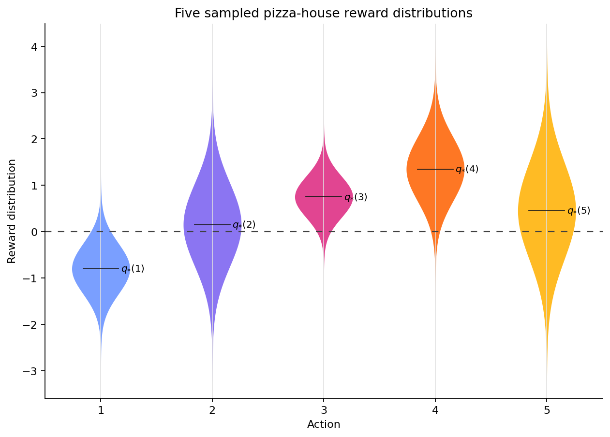
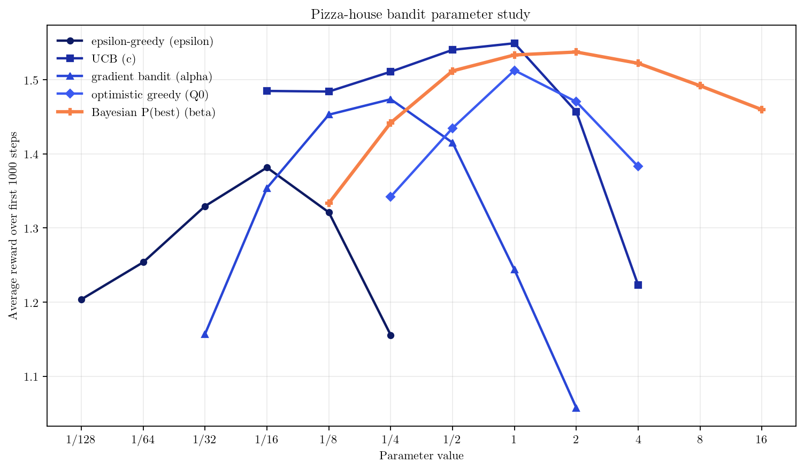

# Gaussian K-Armed Bandit Study
> [!NOTE]
> This is a week-end project where I tried heavly leaning into AI for math generation.

Here I tried to "solve" the k-armed bandit problem in a fully Bayesian way. I gave the idea, pointed at the problem, gave some directions, checked the math. But the equation where entirely AI-written. Then asked the model to run experiments.

The whole ideation + development phases ended up lasting an evening and archieved some really competitive results!

## Problem Setup

Each arm $k$ has an unknown reward distribution:

$$
r_{k,i} \mid \mu_k, \sigma_k^2 \sim \mathcal N(\mu_k, \sigma_k^2)
$$

where:

- $\mu_k$ is the true latent expected reward of arm $k$;
- $\sigma_k^2$ is the intrinsic reward variance of arm $k$;
- $r_{k,i}$ is the observed reward from one pull.

The experiment environment samples different true means and standard deviations for each arm. The algorithms only observe the rewards they receive.

## Bayesian Model

For each arm, the Bayesian method maintains a Normal-Inverse-Gamma posterior over the unknown Gaussian parameters:

$$
p(\mu_k, \sigma_k^2 \mid D_k)
$$

where $D_k$ is the set of observed rewards from arm $k$.

The marginal posterior over the latent mean is Student-t:

$$
\mu_k \mid D_k \sim t
$$

And the posterior predictive density can be written as

$$
p(r \mid D_k)=
\int p(r \mid \mu_k, \sigma_k^2)\, p(\mu_k, \sigma_k^2 \mid D_k)\, d\mu_k\, d\sigma_k^2,
$$
However, the quantity we ultimately care about is not just the next noisy reward. We care about which arm has the largest expected reward:

$$
k^\star = \arg\max_j \mu_j
$$

The Bayesian policy therefore asks:

$$
\mathbb P(k^\star = k \mid D)
$$

That is, for each arm, what is the posterior probability that it is truly the best?

In the study loop, this is implemented as posterior sampling over latent means. With the default small temperature, the policy is close to Thompson sampling: draw one possible mean for each arm, then mostly choose the sampled winner.

For the full derivation of the posterior updates, predictive distributions, probability-of-best integral, and the relationship to UCB, see [math.md](math.md).
# Results

The benchmarks are the standard algorithms from Sutton and Barto's reinforcement
learning book:

| Algorithm | Tuned parameter | Idea |
|---|---:|---|
| epsilon-greedy | `epsilon` | Usually exploit the current best sample mean, sometimes explore randomly. |
| UCB | `c` | Add an optimism bonus to uncertain arms. |
| gradient bandit | `alpha` | Learn soft preferences using reward advantages. |
| optimistic greedy | `Q0` | Start with optimistic values to force early exploration. |
| Bayesian P(best) | `kappa`, `temperature`, `alpha`, or `beta` | Use posterior uncertainty over latent mean reward. |

Latest beta sweep:

| Algorithm | Parameter | Best value | Average reward |
|---|---:|---:|---:|
| epsilon-greedy | `epsilon` | 0.0625 | 1.3814 |
| UCB | `c` | 1 | 1.5490 |
| gradient bandit | `alpha` | 0.25 | 1.4735 |
| optimistic greedy | `Q0` | 1 | 1.5125 |
| Bayesian P(best) | `beta` | 2 | 1.5372 |

UCB is the best curve in this sweep, with average reward `1.5490`. Bayesian
P(best) is second at `1.5372`, only `0.0118` behind, and ahead of optimistic
greedy, gradient bandit, and epsilon-greedy. The best Bayesian value here is
`beta=2`.

For setup, runtime notes, sweep configuration, and tests, see [RUNNING.md](RUNNING.md).

## Acknowledgements

After finishing the project i realised that this idea is not entirely new. The core Bayesian move here, sampling from the posterior over arm quality and acting according to the sampled winner, is
closely related to Thompson sampling and posterior probability matching, going back to Thompson's original 1933 paper and its modern treatments:

- W. R. Thompson, ["On the Likelihood that One Unknown Probability Exceeds Another in View of the Evidence of Two Samples"](https://doi.org/10.1093/biomet/25.3-4.285), *Biometrika*, 1933.
- Daniel J. Russo, Benjamin Van Roy, Abbas Kazerouni, Ian Osband, and Zheng Wen, ["A Tutorial on Thompson Sampling"](https://doi.org/10.1561/2200000070), *Foundations and Trends in Machine Learning*, 2018.
- Sudipto Guha and Kamesh Munagala, ["Stochastic Regret Minimization via Thompson Sampling"](https://proceedings.mlr.press/v35/guha14.html), *COLT / PMLR 35*, 2014.

The more specific best-arm-identification point of view, where the object of
interest is the posterior probability that an arm is truly optimal, has also
been studied in Bayesian best-arm identification:

- Daniel Russo, ["Simple Bayesian Algorithms for Best Arm Identification"](https://proceedings.mlr.press/v49/russo16.html), *COLT / PMLR 49*, 2016.

So the contribution here is not a claim of novelty. The point of this project
is to treat the bandit problem as a personal exercise: use AI to help derive the math,
run the experiment, and see whether this style of fast, exploratory,
AI-assisted work can be a useful way of doing research.
